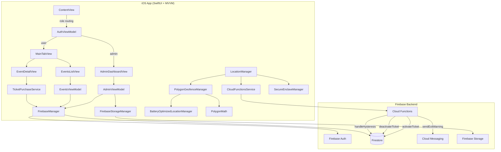
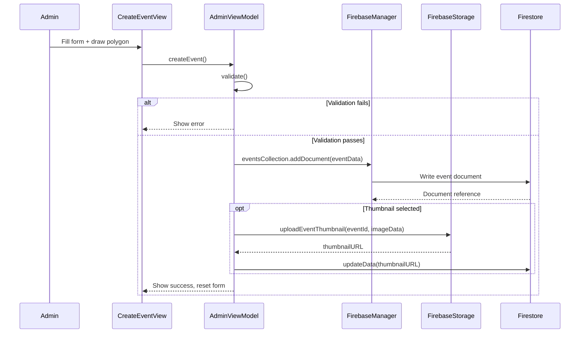
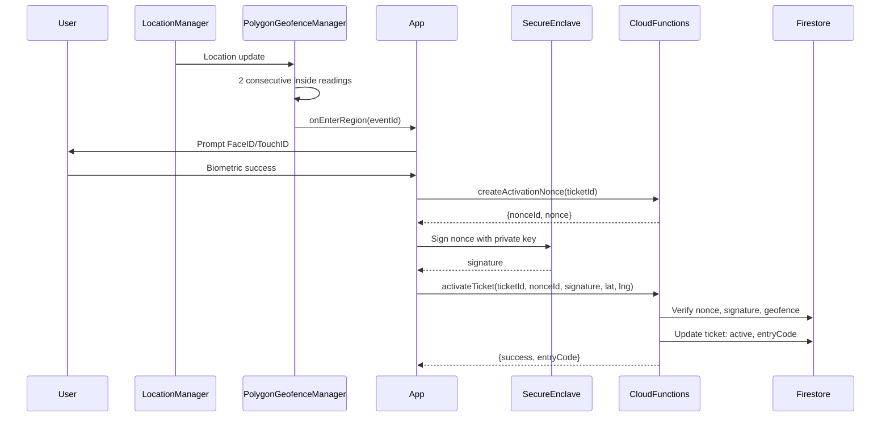

# Design Document: Admin Event Creation and Management Flow

## Overview

This design covers the end-to-end admin event lifecycle in the DigiFence iOS app: authentication with role-based routing, event creation with polygon geofence drawing, event publishing to Firestore, lifecycle management (activate/deactivate), real-time guest monitoring, and attendance log viewing. It also covers the user-facing counterparts: event discovery, ticket purchase, geofence-based ticket activation with biometric verification, and the 3-minute grace period on geofence exit.

The system is built on SwiftUI with MVVM, backed by Firebase Auth, Firestore, Cloud Functions, Cloud Messaging, MapKit, and CoreLocation. All sensitive ticket state mutations happen server-side via Cloud Functions using the Admin SDK, while Firestore security rules enforce strict client-side access control.

### Key Design Decisions

1. **Polygon-based geofencing over circular regions**: CoreLocation's native `CLCircularRegion` is limited to 20 monitored regions and circular shapes. DigiFence uses custom polygon geofencing via ray-casting (`PolygonMath.isPointInsidePolygon`) with `BatteryOptimizedLocationManager` for continuous evaluation, enabling arbitrary venue shapes.

2. **Server-side ticket mutations only**: Firestore rules deny all client-side ticket updates. Only Cloud Functions (Admin SDK) can transition ticket status, set `biometricVerified`, `insideFence`, `activatedAt`, and `entryCode`. This prevents client-side tampering.

3. **Hysteresis for entry/exit detection**: Both entry and exit require 2 consecutive consistent readings before triggering state transitions. This prevents GPS jitter from causing false activations or premature grace period starts.

4. **Nonce-based biometric verification**: Ticket activation uses a challenge-response flow: the server generates a cryptographic nonce, the client signs it with the Secure Enclave private key, and the server verifies the signature against the stored public key. Nonces expire after 60 seconds and are single-use.

5. **Dual safety net for grace period**: The client-side `PolygonGeofenceManager` runs a 3-minute timer, and the server-side `handleHysteresis` Cloud Function runs every minute as a safety net to expire tickets that have been outside the fence for ≥3 minutes.

## Architecture



### Data Flow: Event Creation



### Data Flow: Ticket Activation



## Components and Interfaces

### Views

| View | Responsibility |
|------|---------------|
| `ContentView` | Root router: loading → onboarding → login → MainTabView, based on `FirebaseManager.isLoggedIn` and `appUser.role` |
| `LoginView` | Email/password, Google, Apple sign-in forms |
| `AdminDashboardView` | Lists admin's events with real-time ticket stats; navigates to `EventGuestTrackerView` |
| `AdminMapView` (CreateEventView) | Map with polygon drawing, search bar, "My Location" button; opens `CreateEventSheet` |
| `CreateEventSheet` | Form: title, description, capacity, price, invitation URL, thumbnail picker, date pickers |
| `EventGuestTrackerView` | Per-event detail: stats header, capacity bar, guest list tab, attendance logs tab, activate/deactivate toggle |
| `EventsListView` | User-facing list of active events with search |
| `EventDetailView` | Event detail with polygon map, ticket purchase button |
| `MainTabView` | Tab bar for user navigation (events, my pass, etc.) |

### ViewModels

| ViewModel | Key Methods | State |
|-----------|------------|-------|
| `AuthViewModel` | `signUp()`, `signIn()`, `signInWithGoogle()`, `signInWithApple()`, `signOut()` | `email`, `password`, `isLoading`, `errorMessage` |
| `AdminViewModel` | `createEvent()`, `startListeningToMyEvents()`, `stopListening()`, `startListeningToTickets(for:)`, `stopListeningToTickets(for:)`, `fetchAttendanceLogs(for:)`, `toggleEventActive(event:)`, `addPolygonPoint(_:)`, `removeLastPolygonPoint()`, `clearPolygonPoints()`, `performSearch()`, `centerOnUserLocation(cameraPosition:)` | `title`, `description`, `polygonPoints`, `capacity`, `ticketPrice`, `startsAt`, `endsAt`, `myEvents`, `eventTickets`, `eventAttendanceLogs`, `isLoading`, `errorMessage` |
| `EventsViewModel` | `startListening()`, `stopListening()`, `filteredEvents(searchText:)` | `events`, `isLoading`, `errorMessage` |

### Services

| Service | Responsibility |
|---------|---------------|
| `FirebaseManager` (singleton) | Auth state listener, Firestore collection references, user document CRUD, `appUser` publisher |
| `CloudFunctionsService` (singleton) | Callable wrappers: `createActivationNonce`, `activateTicket`, `deactivateTicket`, `sendExitWarningNotification`, `revokePublicKey` |
| `LocationManager` (singleton) | CLLocationManager delegate, polygon monitoring orchestration via `PolygonGeofenceManager`, grace timer delegation, persisted monitored event IDs |
| `PolygonGeofenceManager` (singleton) | Subscribes to `BatteryOptimizedLocationManager`, evaluates all monitored polygons per location update, manages hysteresis counters and grace timers, publishes `isInsideGeofence`, `distanceToEdge`, `isInActivationZone` |
| `BatteryOptimizedLocationManager` (singleton) | Debounced location updates, adaptive accuracy based on proximity to polygon edges |
| `FirebaseStorageManager` (singleton) | Upload event thumbnail images to Firebase Storage |
| `SecureEnclaveManager` (singleton) | Generate P-256 key pair in Secure Enclave, sign data, export public key |
| `PushManager` (singleton) | FCM token registration, push notification permission |
| `TicketPurchaseService` | Firestore transaction: verify capacity, create ticket, increment `ticketsSold` |

### Cloud Functions

| Function | Trigger | Responsibility |
|----------|---------|---------------|
| `createActivationNonce` | Callable | Generate 32-byte nonce with 60s TTL, store in `activation_nonces` |
| `activateTicket` | Callable | Validate nonce, verify ECDSA signature, check polygon geofence, transition ticket to `active`, assign entry code, write attendance log |
| `deactivateTicket` | Callable | Set ticket to `expired`, write attendance log |
| `sendExitWarningNotification` | Callable | Set `insideFence: false`, send FCM push, write exit attendance log |
| `onFirstLoginAssignRole` | Callable | Create user document with role based on admin email whitelist |
| `handleHysteresis` | Scheduled (every 1 min) | Expire active tickets outside fence for ≥3 min; close events past `endTime` |
| `revokePublicKey` | Callable | Null out user's public key, expire all active tickets |

### Utility Modules

| Module | Functions |
|--------|----------|
| `PolygonMath` | `isPointInsidePolygon`, `distanceFromPointToSegment`, `distanceFromPointToPolygonEdge`, `isPointInActivationZone`, `centroid(of:)` |
| `Haversine` | `distance(from:to:)` — great-circle distance in meters |

## Data Models

### Firestore Collections

#### `users/{uid}`
```
{
  email: string,
  displayName: string,
  role: "admin" | "user",
  publicKey: string | null,       // Base64 X9.62 uncompressed EC P-256 public key
  deviceId: string | null,
  fcmToken: string | null,
  createdAt: Timestamp
}
```

#### `events/{eventId}`
```
{
  title: string,                   // Required, non-empty
  description: string | null,
  polygonCoordinates: [            // Min 3 vertices, non-self-intersecting
    { lat: number, lng: number }
  ],
  organizerId: string,             // Admin UID
  capacity: number,                // >= 1
  ticketsSold: number,             // Initialized to 0
  ticketPrice: number | null,
  thumbnailURL: string | null,
  invitationURL: string | null,
  startsAt: Timestamp,
  endsAt: Timestamp,
  isActive: boolean,               // true on creation
  createdAt: Timestamp             // Server timestamp
}
```

#### `tickets/{ticketId}`
```
{
  eventId: string,
  ownerId: string,                 // User UID
  status: "pending" | "active" | "expired",
  biometricVerified: boolean,      // false on creation
  insideFence: boolean,            // false on creation
  activatedAt: Timestamp | null,
  entryCode: string | null,        // 6-char alphanumeric, assigned on activation
  createdAt: Timestamp
}
```

#### `attendance_logs/{logId}`
```
{
  ticketId: string,
  type: "activated" | "exited" | "expired",
  detail: map,                     // Varies by type
  timestamp: Timestamp
}
```

#### `activation_nonces/{nonceId}`
```
{
  ticketId: string,
  nonce: string,                   // Base64 32-byte random
  expiresAt: Timestamp,            // 60 seconds from creation
  used: boolean
}
```

### Swift Models

The existing Swift models (`Event`, `Ticket`, `AppUser`, `AttendanceLog`) map directly to the Firestore schemas above using `@DocumentID`, `@ServerTimestamp`, and `Codable` conformance. Key computed properties:

- `Event.polygonCLCoordinates` — converts `[GeoPoint_DF]` to `[CLLocationCoordinate2D]`
- `Event.coordinate` — polygon centroid for map camera
- `Event.remainingTickets` — `capacity - ticketsSold`
- `Ticket.isActive/isPending/isExpired` — status convenience checks
- `Ticket.statusDisplayText/statusColor` — UI presentation helpers

### Firestore Security Rules Summary

| Collection | Read | Create | Update | Delete |
|-----------|------|--------|--------|--------|
| `users/{uid}` | Owner or admin | Owner (role must be "user") | Owner (cannot change role) | Denied |
| `events/{eventId}` | Any authenticated | Authenticated (organizerId == uid) | Organizer only | Organizer only |
| `tickets/{ticketId}` | Owner or admin | Authenticated (ownerId == uid, status == "pending", biometric == false, insideFence == false) | Denied (server-only) | Denied |
| `activation_nonces` | Denied | Denied | Denied | Denied |
| `attendance_logs` | Any authenticated | Denied (server-only) | Denied | Denied |


## Correctness Properties

*A property is a characteristic or behavior that should hold true across all valid executions of a system — essentially, a formal statement about what the system should do. Properties serve as the bridge between human-readable specifications and machine-verifiable correctness guarantees.*

### Property 1: Role-based routing correctness

*For any* authenticated user with a Firestore document, if the user's role is `"admin"` the routing logic should produce the admin dashboard destination, and if the role is `"user"` it should produce the standard user interface destination. The mapping must be exhaustive over the `UserRole` enum.

**Validates: Requirements 1.1, 1.2**

### Property 2: Event form validation rejects invalid input

*For any* event form input where the title is empty/whitespace-only, OR the capacity is less than 1, OR the polygon has fewer than 3 vertices, the `validate()` function should return `false` and set the appropriate error message. Conversely, for any input where all three constraints are satisfied and the polygon is non-self-intersecting, `validate()` should return `true`.

**Validates: Requirements 3.4, 3.5, 4.6**

### Property 3: Polygon point add/undo round-trip

*For any* sequence of polygon points and any new coordinate, calling `addPolygonPoint(coordinate)` followed by `removeLastPolygonPoint()` should restore the polygon points array to its original state.

**Validates: Requirements 4.2, 4.4**

### Property 4: Polygon clear invariant

*For any* non-empty polygon points array, calling `clearPolygonPoints()` should result in an empty array.

**Validates: Requirements 4.5**

### Property 5: Self-intersecting polygon detection

*For any* polygon where two non-adjacent edges cross, `isPolygonSelfIntersecting` should return `true`. For any simple (non-self-intersecting) polygon, it should return `false`.

**Validates: Requirements 4.7**

### Property 6: Event document contains all required fields

*For any* valid event form input (title non-empty, capacity ≥ 1, polygon ≥ 3 non-self-intersecting vertices), the event data dictionary constructed by `createEvent()` should contain all required fields: `title`, `description`, `polygonCoordinates`, `organizerId`, `capacity`, `ticketsSold` (== 0), `startsAt`, `endsAt`, `isActive` (== true), and `createdAt`.

**Validates: Requirements 6.1**

### Property 7: Form reset clears all fields

*For any* state of the AdminViewModel form fields (title, description, polygonPoints, capacity, ticketPrice, invitationURL, selectedImageItem, selectedImageData), calling `resetForm()` should set all fields to their default values: title and description to empty strings, polygonPoints to empty array, capacity to 100, ticketPrice to 0.0, invitationURL to empty string, and image selections to nil.

**Validates: Requirements 6.3**

### Property 8: Ticket count computation correctness

*For any* list of tickets for an event, `activeGuestCount` should equal the count of tickets with `status == .active`, `pendingCount` should equal the count with `status == .pending`, `expiredCount` should equal the count with `status == .expired`, and `insideFenceCount` should equal the count with `insideFence == true`. The sum of active + pending + expired should equal the total ticket count.

**Validates: Requirements 8.2**

### Property 9: Attendance logs are ordered by timestamp descending

*For any* list of attendance logs returned by `fetchAttendanceLogs(for:)`, each log's timestamp should be greater than or equal to the next log's timestamp in the list.

**Validates: Requirements 9.1**

### Property 10: Ticket purchase maintains capacity invariant

*For any* event with `ticketsSold < capacity`, a successful ticket purchase should increment `ticketsSold` by exactly 1 and create a ticket with `status == "pending"`, `biometricVerified == false`, `insideFence == false`, and correct `eventId` and `ownerId`. For any event where `ticketsSold >= capacity`, the purchase should be rejected.

**Validates: Requirements 11.2, 11.3**

### Property 11: Geofence state transitions require hysteresis confirmation

*For any* sequence of location readings relative to a polygon geofence, an entry event should only fire after 2 consecutive "inside" readings, and an exit event should only fire after 2 consecutive "outside" readings. A single contradictory reading between two consistent readings should not trigger a state transition.

**Validates: Requirements 12.2, 13.1**

### Property 12: Ticket activation sets all required fields

*For any* successful `activateTicket` Cloud Function call, the resulting ticket document should have `status == "active"`, `biometricVerified == true`, `insideFence == true`, a non-null `entryCode` of exactly 6 alphanumeric characters, and a non-null `activatedAt` timestamp.

**Validates: Requirements 12.5**

### Property 13: Grace timer cancellation on re-entry

*For any* active grace timer for a ticket, if the user re-enters the geofence (confirmed by hysteresis), the grace timer should be cancelled and the `insideFence` status should be restored to `true`.

**Validates: Requirements 13.3**

### Property 14: Grace timer expiry triggers deactivation

*For any* active grace timer that reaches its 3-minute expiry without the user re-entering the geofence, the `onGracePeriodExpired` callback should fire, leading to a `deactivateTicket` call that sets the ticket status to `"expired"`.

**Validates: Requirements 13.4**

### Property 15: Server-side hysteresis expires stale tickets

*For any* active ticket with `insideFence == false` whose most recent exit log timestamp is ≥ 3 minutes ago, the `handleHysteresis` Cloud Function should set the ticket status to `"expired"` and write an attendance log with reason `"hysteresis_timeout"`.

**Validates: Requirements 13.5**

### Property 16: Event auto-close on end time

*For any* event where `endsAt` has passed and `isActive == true`, the `handleHysteresis` Cloud Function should set the event to inactive and expire all associated active tickets, writing an attendance log entry for each with reason `"event_ended"`.

**Validates: Requirements 14.1, 14.2**

### Property 17: Point-in-polygon correctness (ray casting)

*For any* convex polygon and any point known to be inside (e.g., the centroid), `isPointInsidePolygon` should return `true`. For any point sufficiently far outside the polygon's bounding box, it should return `false`.

**Validates: Requirements 12.2, 13.1 (foundational geometry)**

### Property 18: Entry code generation produces valid codes

*For any* call to `generateEntryCode()`, the result should be exactly 6 characters long and contain only characters from the set `ABCDEFGHJKLMNPQRSTUVWXYZ23456789` (no 0, O, 1, I to avoid confusion).

**Validates: Requirements 12.5**

## Error Handling

### Client-Side Error Handling

| Scenario | Handling |
|----------|---------|
| Network failure during event creation | `AdminViewModel` catches the error, sets `errorMessage`, and shows alert via `showError` |
| Firestore listener error | Logged to console; `errorMessage` updated on ViewModel |
| Image upload failure | Error propagated from `FirebaseStorageManager`; event creation fails with error alert |
| Ticket purchase transaction failure | `TicketPurchaseService` catches error, displays to user, no partial ticket created |
| Biometric authentication failure | Error displayed to user; activation flow halted |
| Cloud Function rejection (expired nonce, invalid signature, outside geofence) | Server error message displayed to user via alert |
| Location permission denied | `LocationManager` publishes `authorizationStatus`; UI prompts user to enable in Settings |
| Polygon with < 3 points on submit | Validation prevents submission; error message shown |
| Self-intersecting polygon on submit | Validation prevents submission; inline warning shown |

### Server-Side Error Handling

| Scenario | Handling |
|----------|---------|
| Unauthenticated request | Cloud Function throws `HttpsError("unauthenticated")` |
| Missing required parameters | Cloud Function throws `HttpsError("invalid-argument")` |
| Ticket not found | Cloud Function throws `HttpsError("not-found")` |
| Ticket not owned by requester | Cloud Function throws `HttpsError("permission-denied")` |
| Nonce expired or already used | Cloud Function throws `HttpsError("deadline-exceeded")` or `HttpsError("failed-precondition")` |
| User outside activation zone | Cloud Function logs suspicious attempt to `attendance_logs` and throws `HttpsError("failed-precondition")` with distance info |
| Signature verification failure | Cloud Function logs to `attendance_logs` and throws `HttpsError("unauthenticated")` |
| FCM notification failure | Logged but does not block the exit warning flow |
| Event polygon invalid (< 3 vertices) | Cloud Function throws `HttpsError("failed-precondition")` |

### Firestore Security Rule Denials

All unauthorized operations are silently denied by Firestore rules. The client receives a permission error which is caught and displayed by the respective ViewModel or Service.

## Testing Strategy

### Dual Testing Approach

This feature requires both unit tests and property-based tests for comprehensive coverage:

- **Unit tests**: Verify specific examples, edge cases, integration points, and error conditions
- **Property tests**: Verify universal properties across randomly generated inputs using property-based testing

### Property-Based Testing Configuration

- **Library**: [SwiftCheck](https://github.com/typelift/SwiftCheck) for Swift property-based testing
- **Minimum iterations**: 100 per property test
- **Each property test must reference its design document property**
- **Tag format**: `Feature: digifence-admin-event-flow, Property {number}: {property_text}`
- **Each correctness property must be implemented by a single property-based test**

For Cloud Functions (JavaScript), use [fast-check](https://github.com/dubzzz/fast-check) with the same 100-iteration minimum.

### Unit Test Coverage

| Area | Tests |
|------|-------|
| `AdminViewModel.validate()` | Empty title, whitespace title, capacity 0, capacity -1, < 3 polygon points, valid input |
| `AdminViewModel` polygon ops | Add point, undo on empty, clear on empty |
| `AdminViewModel.createEvent()` | Success path, network error, missing auth |
| `AdminViewModel` listeners | Start/stop listening lifecycle, memory leak prevention |
| `EventsViewModel` | Active events query, search filtering |
| `TicketPurchaseService` | Successful purchase, sold out, transaction failure |
| `PolygonMath` | Known inside/outside points, edge cases (point on vertex, point on edge, degenerate polygon) |
| `PolygonGeofenceManager` | Entry detection, exit detection, hysteresis behavior, grace timer lifecycle |
| Cloud Functions | `activateTicket` happy path, expired nonce, invalid signature, outside geofence, `handleHysteresis` with stale tickets, event auto-close |
| Firestore Rules | Admin event CRUD, user ticket creation, denied client ticket updates, denied writes to protected collections |

### Property Test Coverage

| Property | Test Description | Generator |
|----------|-----------------|-----------|
| P1: Role routing | Generate random `UserRole` values, verify routing destination | `UserRole.arbitrary` |
| P2: Validation | Generate invalid event inputs (empty titles, bad capacity, few points), verify rejection | Custom `EventFormInput.arbitrary` |
| P3: Add/undo round-trip | Generate random coordinate arrays and a new coordinate, verify add+undo restores state | `CLLocationCoordinate2D.arbitrary` |
| P4: Clear invariant | Generate random non-empty coordinate arrays, verify clear empties | `[CLLocationCoordinate2D].arbitrary` |
| P5: Self-intersection | Generate known self-intersecting and simple polygons, verify detection | Custom polygon generators |
| P6: Event document fields | Generate valid event inputs, verify all required fields present | Custom `ValidEventInput.arbitrary` |
| P7: Form reset | Generate random form states, verify reset restores defaults | Custom `FormState.arbitrary` |
| P8: Ticket counts | Generate random ticket lists, verify count partitioning | `[Ticket].arbitrary` |
| P9: Log ordering | Generate random log lists, verify descending timestamp order after sort | `[AttendanceLog].arbitrary` |
| P10: Purchase invariant | Generate events with varying capacity/ticketsSold, verify purchase behavior | Custom `EventCapacity.arbitrary` |
| P11: Hysteresis | Generate sequences of inside/outside readings, verify state transitions only after 2 consecutive | `[Bool].arbitrary` (inside/outside sequence) |
| P12: Activation fields | Generate activation responses, verify all required fields | Custom generator |
| P13: Grace cancel | Generate re-entry scenarios during grace period, verify timer cancelled | Timing sequences |
| P14: Grace expiry | Generate timeout scenarios, verify deactivation triggered | Timing sequences |
| P15: Server hysteresis | Generate ticket sets with varying exit times, verify correct expiration | `[TicketWithExitTime].arbitrary` |
| P16: Event auto-close | Generate events with varying end times, verify closure behavior | `[EventWithEndTime].arbitrary` |
| P17: Point-in-polygon | Generate random convex polygons and test points (centroid inside, far points outside) | Custom polygon + point generators |
| P18: Entry code format | Generate entry codes, verify length and character set | Direct generation |

### Integration Tests

- End-to-end event creation flow (admin login → create event → verify in Firestore)
- Ticket purchase with capacity verification
- Activation flow with mocked biometrics and Cloud Functions
- Grace period flow with simulated geofence exit/re-entry
- `handleHysteresis` scheduled function with test data
- Firestore security rules using the Firebase Emulator Suite
